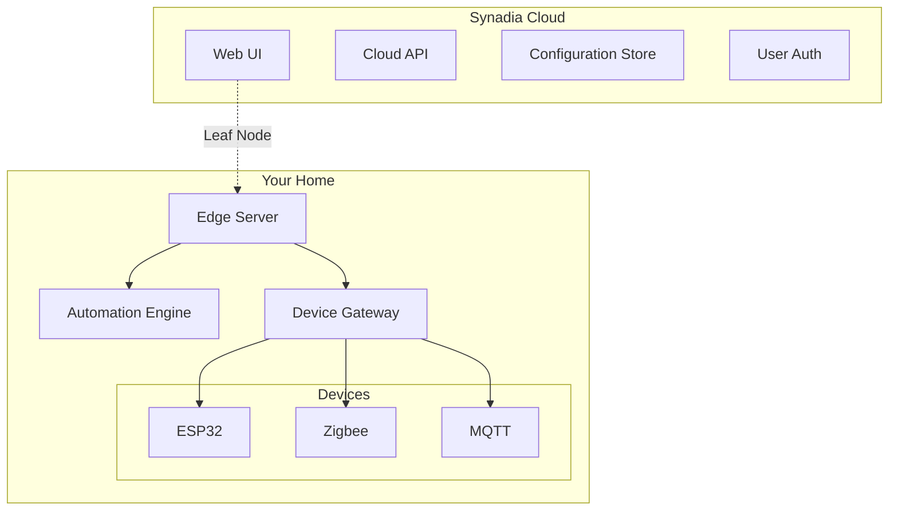

# NATS Home Automation

> The most secure, reliable, and easy-to-use open source home automation platform.

[](LICENSE)
[](https://hub.docker.com/r/calmera/nats-home-edge)
[](https://discord.gg/nats-home)

## 🚀 Get Started in 5 Minutes

1. **Sign up for Synadia Cloud** (free)
   ```
   https://app.ngs.global
   ```

2. **Run the edge server at home**
   ```bash
   docker run -d \
     --name nats-home \
     --network host \
     -v ~/nats-home.creds:/creds/cloud.creds:ro \
     -e HOME_NAME="My Home" \
     ghcr.io/calmera/nats-home-edge:latest
   ```

3. **Access the UI**
   ```
   https://home.nats.cloud
   ```

That's it! Start adding devices and creating automations.

## 🏗️ Architecture



### Why This Architecture?

- **🔒 Secure**: Each device has unique credentials, no shared passwords
- **🏠 Local First**: Automations run at home, work without internet
- **☁️ Cloud Managed**: Configure from anywhere, automatic backups
- **⚡ Fast**: Sub-millisecond local communication
- **🔧 Simple**: One container at home, UI in the cloud

## 🎯 Features

### For Users
- **Visual Automation Designer** - Drag & drop, no coding required
- **Multi-Home Support** - Manage vacation home, office, etc.
- **Family Sharing** - Invite family members with permissions
- **Voice Control** - Alexa, Google Assistant, Siri
- **Energy Monitoring** - Track usage, set limits

### For Developers
- **Protocol Agnostic** - MQTT, HTTP, WebSocket, native NATS
- **ESPHome Integration** - First-class support
- **REST API** - Full cloud API access
- **WebHooks** - Integrate with anything
- **Extensible** - Add custom device types

### For Tinkerers
- **100% Open Source** - No vendor lock-in
- **Run Anywhere** - Docker, Kubernetes, bare metal
- **Export Everything** - Your data, your rules
- **Local Mode** - Works without cloud
- **Custom Firmware** - Build your own devices

## 📦 Supported Devices

### Native Support
- **ESP32/ESP8266** - Via ESPHome or Arduino
- **Zigbee** - Via Zigbee2MQTT bridge
- **Z-Wave** - Via Z-Wave JS bridge
- **MQTT** - Any MQTT device
- **Tasmota** - Full support
- **Shelly** - Direct integration

### Through Bridges
- Home Assistant devices
- Hubitat devices
- SmartThings devices
- Apple HomeKit devices

## 🛠️ Advanced Setup

### Custom Configuration

Create `config/edge.yaml`:
```yaml
cloud:
  url: tls://connect.ngs.global
  credentials: /creds/cloud.creds

home:
  name: "Beach House"
  location:
    latitude: 25.7617
    longitude: -80.1918
    timezone: America/Miami

gateway:
  bridges:
    zigbee:
      enabled: true
      device: /dev/ttyUSB0
```

### High Availability

Run multiple edge servers:
```bash
docker run -d \
  --name nats-home-primary \
  -e EDGE_ROLE=primary \
  ...

docker run -d \
  --name nats-home-backup \
  -e EDGE_ROLE=backup \
  ...
```

### Kubernetes

```bash
helm repo add nats-home https://charts.nats-home.io
helm install edge nats-home/edge \
  --set synadia.creds=<base64-encoded-creds>
```

## 🔧 Building from Source

### Edge Server
```bash
cd edge
go build -o nats-home-edge ./cmd/edge
```

### Web UI
```bash
cd cloud/web-ui
npm install
npm run build
```

## 🤝 Contributing

We love contributions! See [CONTRIBUTING.md](CONTRIBUTING.md) for guidelines.

### Development Setup
```bash
# Clone the repo
git clone https://github.com/calmera/nats-home-automation
cd nats-home-automation

# Run locally
task dev
```

## 📚 Documentation

- [Quick Start Guide](docs/quickstart.md)
- [Architecture Overview](docs/architecture.md)
- [Device Integration](docs/devices/)
- [Automation Examples](docs/automations/)
- [API Reference](docs/api/)

## 🆘 Support

- **Discord**: [Join our community](https://discord.gg/nats-home)
- **GitHub Issues**: [Report bugs](https://github.com/calmera/nats-home-automation/issues)
- **Discussions**: [Ask questions](https://github.com/calmera/nats-home-automation/discussions)

## 📄 License

NATS Home Automation is licensed under the [Apache 2.0 License](LICENSE).

---

Built with ❤️ using [NATS.io](https://nats.io) and [Synadia Cloud](https://synadia.com)