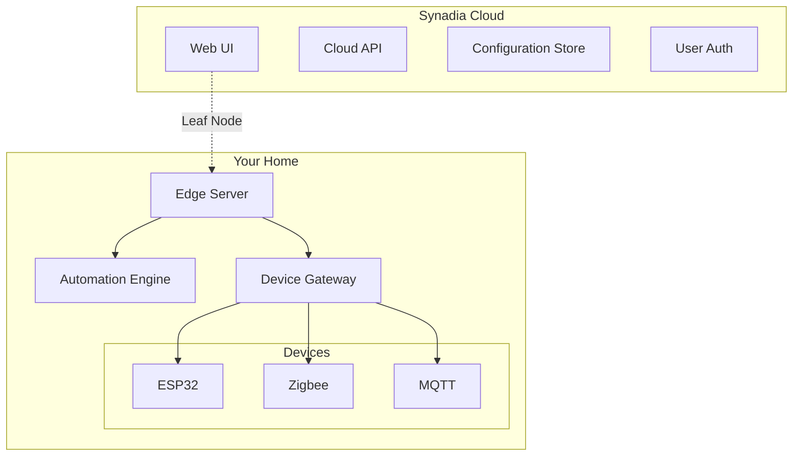

# Homix 🏠

> Home automation, beautifully mixed - secure, reliable, and brilliantly simple.

[](LICENSE)
[](https://hub.docker.com/r/calmera/homix-edge)
[](https://discord.gg/homix)

## 🚀 Get Started in 5 Minutes

1. **Sign up for Synadia Cloud** (free)
   ```
   https://app.ngs.global
   ```

2. **Run the installer**
   ```bash
   curl -sSL https://get.homix.dev | sh
   ```

3. **Access the UI**
   ```
   https://app.homix.dev
   ```

That's it! Your home automation system is running.

## 🏗️ Architecture



### Why This Architecture?

- **🔒 Secure**: Each device has unique JWT credentials
- **🏠 Local First**: Automations run at home, work offline
- **☁️ Cloud Managed**: Configure from anywhere
- **⚡ Fast**: Sub-millisecond local communication
- **🔧 Simple**: One container at home

## 🎯 Key Features

- **Visual Automation Designer** - No coding required
- **Multi-Home Support** - Manage multiple locations
- **Per-Device Security** - Unique credentials for each device
- **Offline Operation** - Works without internet
- **Energy Monitoring** - Track usage and costs

## 📦 Supported Devices

- **ESP32/ESP8266** (ESPHome, Arduino)
- **Zigbee** (via Zigbee2MQTT)
- **Z-Wave** (via Z-Wave JS)
- **MQTT** devices
- **Tasmota** devices
- **HTTP/REST** APIs

## 📚 Documentation

- [Quick Start Guide](QUICKSTART.md)
- [Architecture Overview](REFACTOR-PLAN.md)
- [Edge Server Configuration](edge/README.md)
- [Device Integration](docs/devices/)
- [Security Model](docs/security/)

## 🛠️ Advanced Usage

### Custom Configuration

```yaml
# edge-config.yaml
cloud:
  url: tls://connect.ngs.global
  credentials: /creds/cloud.creds

home:
  name: "Beach House"
  location:
    latitude: 25.7617
    longitude: -80.1918
```

### Run Without Installer

```bash
docker run -d \
  --name nats-home-edge \
  --network host \
  -v ~/nats-home.creds:/creds/cloud.creds:ro \
  -e HOME_NAME="My Home" \
  ghcr.io/calmera/homix-edge:latest
```

### Development

```bash
# Clone repository
git clone https://github.com/calmera/nats-home-automation
cd nats-home-automation

# Run edge server locally
cd edge
go run ./cmd/edge

# Run with hot reload
task dev
```

## 🤝 Contributing

We welcome contributions! See [CONTRIBUTING.md](CONTRIBUTING.md) for guidelines.

## 🆘 Support

- **Discord**: [Join our community](https://discord.gg/nats-home)
- **Issues**: [Report bugs](https://github.com/calmera/nats-home-automation/issues)
- **Discussions**: [Ask questions](https://github.com/calmera/nats-home-automation/discussions)

## 📄 License

Apache 2.0 - see [LICENSE](LICENSE)

---

Built with ❤️ using [NATS.io](https://nats.io) and [Synadia Cloud](https://synadia.com)